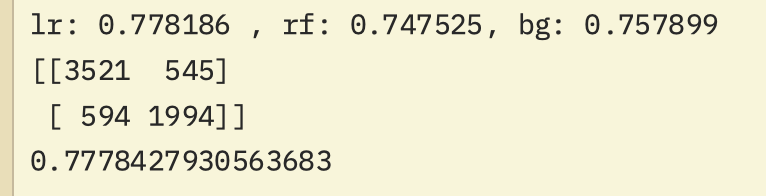

# This is an analyze to predict an impact of bird strike in during flight

*Note*:
- 2024-12-29:This is a project for y own study when I learn about machine learning. Today I remember this because the aircaft has a bird strike today and I heard a lot bad news in aviation.
- I hope everyone have peace.

## Requirement:
> pip install install requirements.txt

## Technical:
- Data understanding
- Feature selection
- Clean data
- Preprocessing data
- Build model ( supervised learning)
- Evaluate model
- Ensamle model

## Start Project

> python clean.py

> python model.py

## Conclusion

| Prediction | Negative | Positive |
|------------|----------|----------|
| Negative   | 3550     | 516      |
| Positive   | 633      | 1955     |

- False Positives (516): The model incorrectly predicted bird strikes when they didn't occur 516 times
- False Negatives (633): More worryingly, the model missed 633 actual bird strikes, which is particularly problematic for aviation safety
- **0.77 score** is mediacre, for a safety-critical application like predicting bird strikes, we would want a much higher F1 score
- Missing 633 actual bird strikes (false negatives) could have serious safety implications
- The model's accuracy isn't strong enough for real-world deployment

## Recommendations for improvement

- Experiment with different model architectures (Hopefully, I will find a better model)
- Consider using more sophisticated sampling techniques (I hope that I know to to well-pridict the strikes)
- ...
